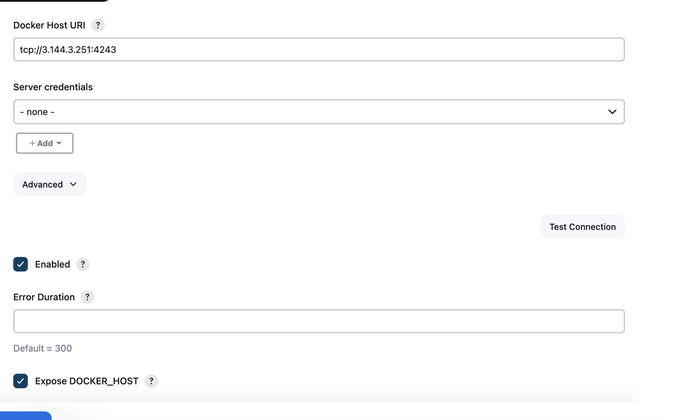
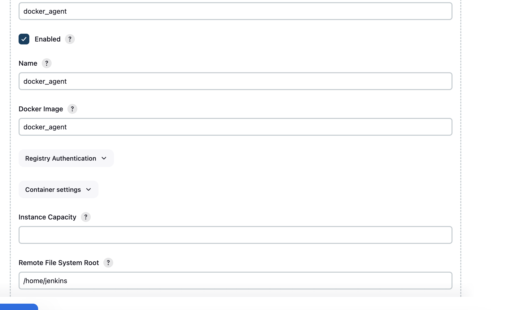
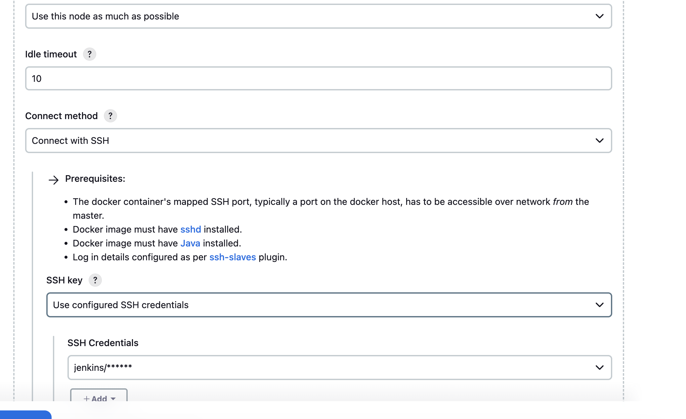
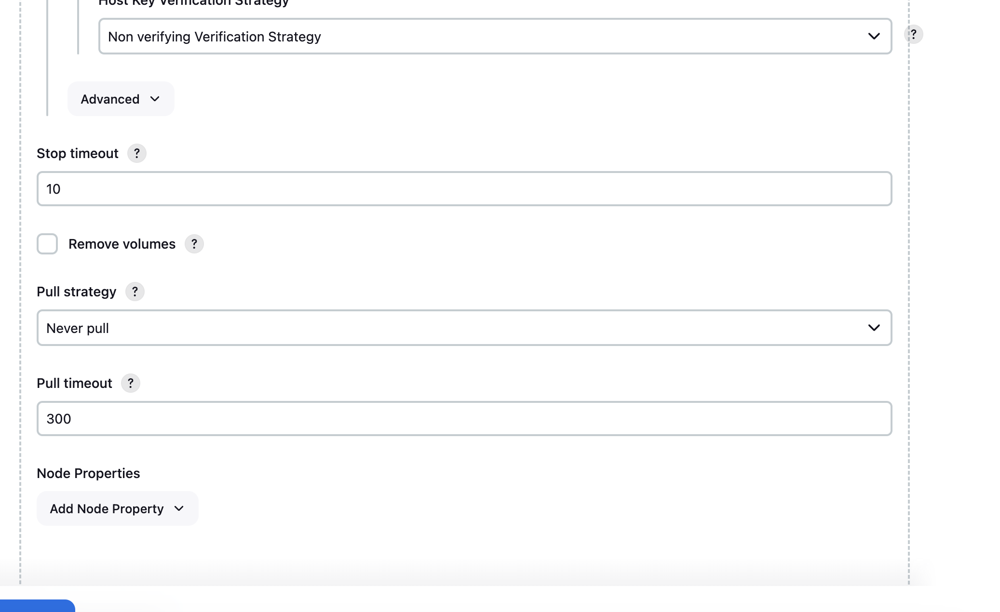

# Installing and Setup Jenkins using Docker

1. Pull the Jenkins Docker Image from Docker Hub
   - `docker pull jenkins/jenkins`
2. Run the Docker Jenins Container using the below command
   ```
       docker run \
       --restart=on-failure
       --name jenkins \
       --detach \
       --port 8080:8080 --port 50000:50000 \
       --network jenkins
       --volume jenkins_data:/var/jenkins_home \
       jenkins/jenkins
   ```
3. Access the jenkins application in the web browser using the below link
   - `http://localhost:8080`
4. Setup the Jenkins and create user account by following the instructions

---

# Setup Docker Cloud Agents for Jenkins

1. Create a EC2 Instance in AWS
   - Name : **jenkins_docker_host**
   - AMI: **Ubuntu:22.04**
   - Instance Type: **t3.micro**
   - Keypair: **create new key pair / choose existing one**
   - Security Group: **create a security group which allows PORT 22 for ssh, 4243 to access docker and 32768-60999 to create dynamic container agents**
2. Install the required dependencies using the below script

   - ```
      #! /bin/bash

      # Add Docker's official GPG key:
      yes | sudo apt-get update
      yes | sudo apt-get install ca-certificates curl
      yes | sudo install -m 0755 -d /etc/apt/keyrings
      sudo curl -fsSL https://download.docker.com/linux/ubuntu/gpg -o /etc/apt/keyrings/docker.asc
      sudo chmod a+r /etc/apt/keyrings/docker.asc

      # Add the repository to Apt sources:
      echo \
      "deb [arch=$(dpkg --print-architecture) signed-by=/etc/apt/keyrings/docker.asc] https://download.docker.com/linux/ubuntu \
      $(. /etc/os-release && echo "$VERSION_CODENAME") stable" | \
      sudo tee /etc/apt/sources.list.d/docker.list > /dev/null
      yes | sudo apt-get update

      # install the docker packages
      yes | sudo apt-get install docker-ce docker-ce-cli containerd.io docker-buildx-plugin docker-compose-plugin
     ```

3. Update the Docker library file to expose the docker on PORT 4243
   - open the the file using vim editor **/lib/systemd/system/docker.service**
   - update the **ExecStart** field with below line
     - `ExecStart=/usr/bin/dockerd -H tcp://0.0.0.0:4243 -H unix:///var/run/docker.sock`
4. Reload the system daemon and restart the docker service
   - `sudo systemctl daemon-reload`
   - `sudo systemctl restart docker`
5. Test the docker API exposed on PORT 4243 by using the below command
   - `curl -v http://localhost:4243/version`
6. Pull the git repository to create a docker image for dynamic jenkins docker agent
   - `git clone https://github.com/eswarmaganti/jenkins-docker-agent.git`
7. Build the docker image using the below commands
   - `cd jenkins_docker_agent`
   - `sudo docker build -t docker_agent .`
8. Validate wheter you able the view the custom docker image by using the below command
   - `sudo docker image ls`
9. Open the Jenkins in web browser using the url (http://localhost:8080)
10. Navigate to **manage jenkins > clouds **

- Create a new docker cloud and provide the name as **docker cloud**
- **Configure the docker cloud details**
  - docker host URI will be the IP address of the docker host server we have created in AWS
  - Click on **Test Connection** to test whether we are able to connect to Docker Host server or not
    
- **Configure the docker agent template**
  - While configuring the Docker Agent we have to provide
  - Label: must be unique
  - Name: the name of the agent
  - Docker Image: the tag of docker image we have build in Docker Host AWS EC2 server
  - Remote Filesystem: /home/jenkins
  - Connect Method: Select Connect with SSH and configure the docker image username and password to login into the container
  - Pull Strategy: Never Pull (as we are building it by ourself)
    
    
    
